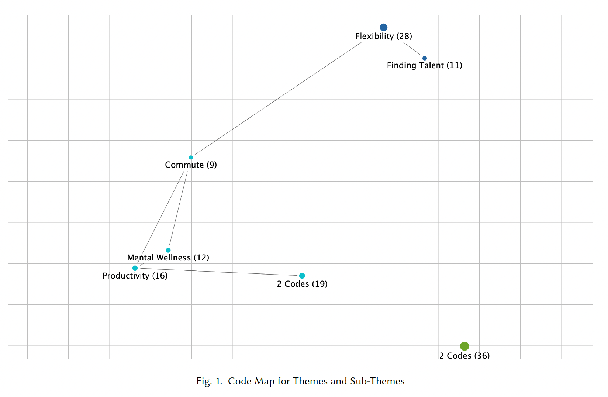
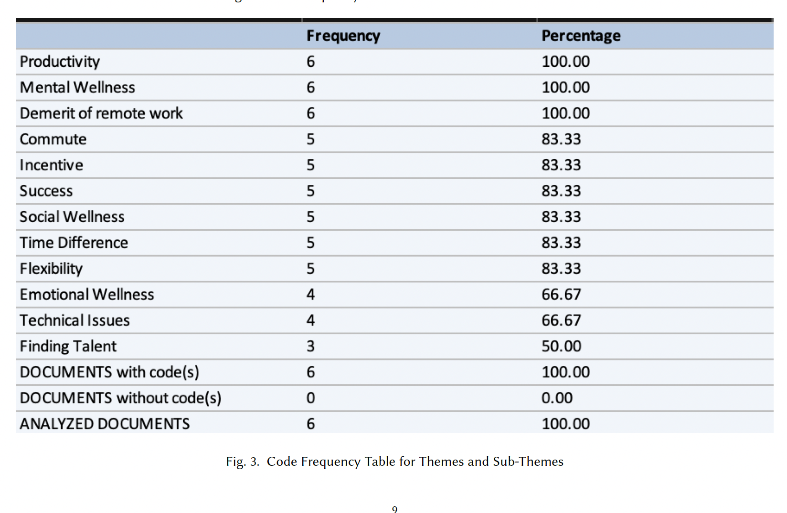
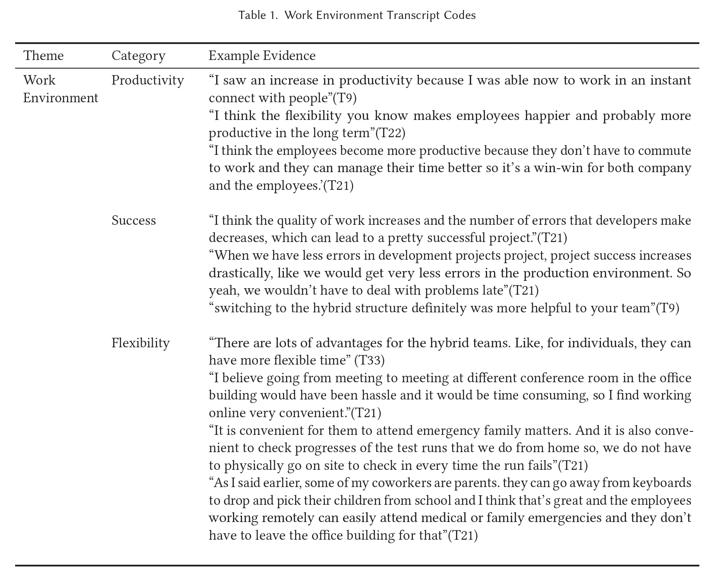
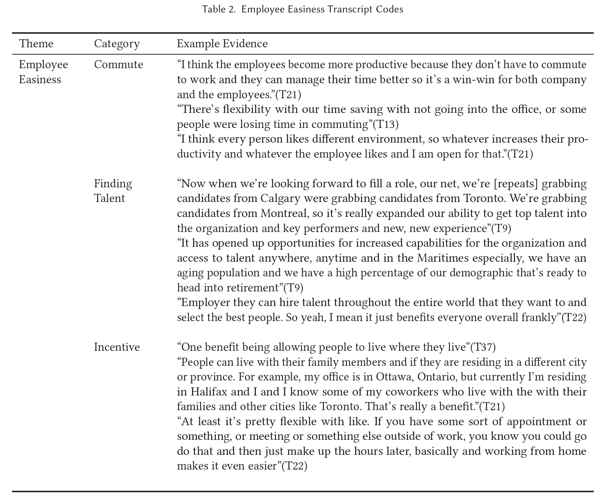
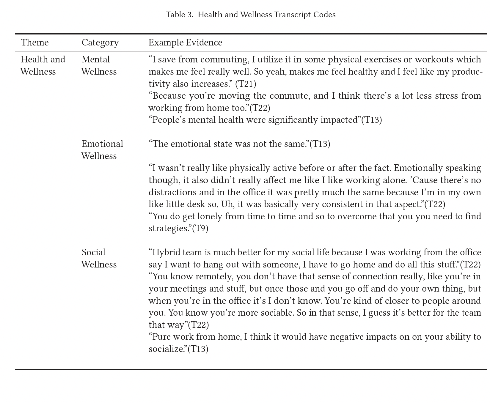
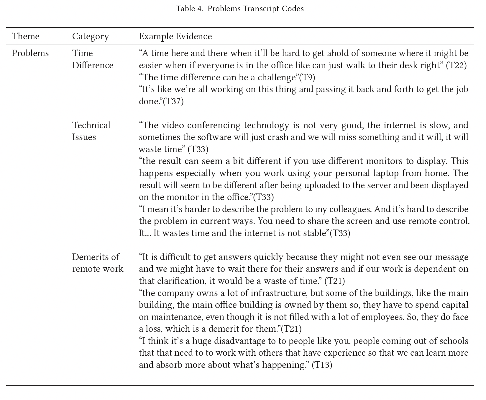

# Thematic analysis of the characteristics benefits and the challenges of hybrid teams in the software industry

In 2020, the coronavirus pandemic compelled software developers to work from home. Many developers found working from home
comforting whereas, some did not find it pleasing. So, the companies are trying the hybrid framework, a combination of work
from home and in-person. There are many characteristics, benefits and challenges of the hybrid teams in the software industry. To
understand the hybrid team framework, the class of CSCI 2690 - Intro to Software Projects at Dalhousie University interviewed
software developers. After the interviews, I was allocated six transcripts, and I performed analysis using the affinity mapping technique
with MAXQDA software. After the analysis, I found four qualities of hybrid work which includes the work environment, employee
easiness, health and wellness, and problems. The results of the analysis would be beneficial to the corporations, which are using the
hybrid framework. It would also be beneficial to developers, who are new to the framework or wants to learn more about the hybrid
teams.

## 1. INTRODUCTION
The COVID-19 pandemic compelled the software developers to adopt a hybrid or fully remote team structure. The
hybrid team structure has its characteristics, benefits, and challenges, so it is crucial to understand the framework as
many companies are moving towards the hybrid team structure in the post-pandemic world. The thematic analysis
report attempts to describe the hybrid team structure with regards to the work environment, employee easiness, health
and wellness, and problems related to the hybrid team structure.

## 2. METHODOLOGY
For the thematic analysis, each individual from the class of CSCI 2690 - Intro to Software Projects at Dalhousie University
interviewed a software developer. I was allocated six interview transcripts, and I put all the interview transcripts
together and analyzed them.
  I performed qualitative analysis on the collected data using the affinity mapping technique. I highlighted all the
necessary quotations from the transcripts that were related to the research questions using MAXQDA, a data analysis
software. Later, I produced code systems and four themes related to the quotations and generated analytical tables,
figures, and other forms of visualizations with the software.

## 3. FINDINGS
There are various characteristics, benefits and the challenges of hybrid teams in the software industry. The hybrid
teams consist of remote developers and in-person developers. As the work environment changes, the developers feel
changes in their productivity, success, and flexibility. They also sense transformation in their health and wellness, such
as mental health, emotional health, and social wellness. Some developers find the hybrid team comforting due to less commute, more incentives,
and less effort in finding jobs. Nevertheless, others find problems with it, including technical
issues, time differences, and other demerits of remote work.

### 3.1 Work Environment
The work environment can be defined "as one in which employees and managers can do whatever they want, whenever
they want, as long as the work gets done" [18]. The work environment plays a significant role for the developers because
if they do not have a healthy work environment, the development quality will decrease. The implication of the quality
decrease will lead to bad products to the users, which would be a loss for the company. Hence, the work environment
affects the productivity and success of the developers. Providing flexibility is one way to boost developers’ productivity,
and hybrid-team provides flexibility to work from home and in person. There are several merits and demerits to the
work environment with the hybrid teams. For instance, the interviewee of transcript 33, believes working in a hybrid
team provides them more flexibility.
```
"There are lots of advantages for the hybrid teams. Like, for individuals, they can have more flexible time." 1
```
  Furthermore, the flexibility of the work makes the developers happier and more productive in the long term. Hence, the increase 
 in productivity due to the development flexibility increases the project’s success.

### 3.2 Employee Easiness
Employee easiness makes a developer’s life easier in any form. Working in a hybrid team means less commute to work,
which saves the hassle of going to the office every day. According to one the interviewee of transcript 13, they find it
flexible and time-saving, which makes their lives easier.
```
"There’s flexibility with our time saving with not going into the office, or some people were losing time in commuting" 2
```
  Moreover, finding developers became easier for the company, as they could hire developers around the globe, allowing
developers to work at overseas companies. For instance, the interviewee of transcript 9 mentioned, they are grabbing
developers around Canada, giving the company top talents, and an opportunity to the developers, which is a win-win
scenario.2
  Hybrid teamwork is a huge benefit to the developers’ community, as they can live with their family and develop
software, giving them a better work-life balance. Hence, the hybrid team increases employee easiness, which increases
the productivity and success rate of the project. The implication of hybrid work is the easiness to find talent around the
globe and better work-life balance.

### 3.3 Health and Wellness
Health and Wellness focuses on mental health, emotional health, and social health. They have a significant impact on
the work progress, which could be a challenge to both the developer and the company. For instance, the interviewee of
transcript 9, felt lonely and isolated so, they had to find strategies to overcome loneliness with the hybrid workplace.3
  In terms of social wellness, developers had mixed feelings. Some developers found it difficult to socialize, whereas
others found it easy. For instance, Transcript 22 interviewee told, ``` "You know remotely, you don’t have that sense of connection 
really like you’re in your meetings and stuff, but once those and you go off and do your own thing, but when you’re in the office it’s 
I don’t know. You’re kind of closer to people around you. You know you’re more sociable. So in that sense, I guess it’s better for the team that way".3 ```
  Hence, the hybrid team had significantly affected the developer’s health and wellness.

### 3.4 Problems
There are challenges of the hybrid team in the software industry, and some of the problems include time differences,
technical issues, and other demerits of remote work. Some developers found it difficult to solve coding problems online,
mainly due to technical limitations. Moreover, time difference between the overseas employees was a huge barrier to
the developers as well. For instance, the interviewees of transcript 21 told, ``` "It is difficult to get answers quickly because 
they might not even see our message and we might have to wait there for their answers, and if our work is dependent on that 
clarification, it would be a waste of time" 4. ``` Hence, working in a hybrid team poses significant challenges in the
software industry, and it impacts their work negatively.

## 4. LITERATURE REVIEW
### 4.1 Work Environment
The work environment is crucial for the developers because it changes their work outcomes. The work environment
impacts the productivity, the success rate, and the flexibility level of the developers. [15] In terms of productivity, it has
shown significant improvement, as the transcript of interviewee 9 mentioned, ```"I saw an increase in productivity because
I was able now to work in an instant connect with people".1```
  The increase in productivity leads to better development of the products. However, to keep the developers productive,
they need to be in better well-being. ```"In most jobs, people are more productive when they experience positive vitality
and well-being, and their productivity is depleted when they are exhausted or stressed and their working habits become
unhealthy."[6, p. 3] ```Hence, companies should focus on making the developer experience more positive to keep them
productive. One way of doing it is to provide work flexibility to the employees, which can be attained through hybrid
work. ```"Work flexibility motivates people to exert their best potential and complete their assigned tasks much earlier
than scheduled. Therefore, employees can deliver more outputs in a specific time." [19, p. 1504]```
  As shown in the code map 1, flexibility is indirectly related to the productivity of the employees. Hence, providing
flexibility will increase the work productivity. Furthermore, the success rate of the developers also increases with a
better work environment. "The well-being, happiness, and work settings of software professionals have a remarkable
effect on the quality of the output, their motivation, and hence on the success of the whole software development
process" [21, p. 3]. Hence, the hybrid team provides flexibility, which improves the productivity of the developers, and
increases the success rate of the developers. Also interviewee of transcript 21 stated, ```"I think the quality of work increases
and the number of errors that developers make decreases, which can lead to a pretty successful project". 1```
  Nevertheless, there are a few challenges of working online that affect the work environment, such as ```"lack of pressure
from the boss, colleagues, and subordinates" [14, p. 517], ```which makes the developers procrastinate. Communication is
another factor, and ```"the key to success within the hybrid environment is to maximize synchronous interactions (where
all group members are present) in the face-to-face" [3, p. 401] room.```

### 4.2 Employee Easiness
The hybrid team provides ```"greater accessibility, more flexibility and reduced commute time" [12, p. 89]. ```This helps
developers manage their time efficiently, which would be a win-win for both employees and the company. Hence, the
non-existent commute and fewer interruptions would increase employee productivity [2].
  Finding talent around the globe is also easier with the hybrid workplace. It increases the opportunities for the
developers that are not physically located in the same place as the company. It also provides a chance to freelancer developers,
who work on a contract for a short period. However, ```"freelancers may provide a lower quality of service
than firm employees" [9, p. 5], ```which could be a demerit to the company. Regardless, some companies, especially
startups, still hire freelancers, as the overseas developers’ costs are lower.
  Another major benefit of a hybrid team is work-life balance. Developers can work and spend time with their families,
which helps them boost their work-life balance. For instance, ```"In an internal analysis of its 150000+ workforce, Microsoft
found that helping employees working remotely with work-life balance and the prioritization of work-related needs
gained greater employee engagement" [11, p. 11].``` Many other technology companies took similar steps towards making
the work hybrid or online. ```"Indeed, Facebook and Twitter have announced that their employees can choose to work
from home “forever” after the pandemic" [1, p. 52].``` Thus, a better work-life balance ultimately helps the company
because the developers would deliver quality code when they have a more satisfying work-life balance.

### 4.3 Health and Wellness
The COVID-19 pandemic was a stressful event for many people. Working from home pushed the stress level higher,
which lead to mental health issues. ```"Spatial separation from the organisational environment removes individuals from
these established social networks and opportunities, causing isolation and anxiety" [8, p. 21]. ```The isolation and anxiety
further lead to mental and emotional health issues in employees which affects their development process.
  When the developers were forced to work online, their stress level increased, as some of them had to take care of
their families and work at the same time. ```"Overtime, increased workload, spending more time on household chores and
childcare, irregular working hours can play a role in sleep disturbances for the remote workers" [4, p. 46].```
`"Low sleep quality disconcerts decision processes and limits one’s capacity for emotional regulation and is found to
be a valuable reserve for daily work engagement of workers" [21, p. 4].` The irregular sleeping hours not only changed their
mental well-being but also emotional well-being. Developers were unable to finish their tasks in the given time due to the 
disturbances, which forced them to work more hours and compromise their sleep. Hence, working from home started becoming an 
issue for them.
  Another issue some developers faced was loneliness.``` "The pandemic has exposed people to social confinement and thus 
  higher levels of loneliness, which may correlate with declining work satisfaction and performance as well as stress
  enhancement" [20, p. 427]. ```Hence, a hybrid team helps to tackle the loneliness because the developers who feel lonely 
  could come and work in person some days, helping defeat loneliness.
  Work engagement could help the developers to tackle mental health issues. One way to do it is by providing ```"engagement 
  manifests itself when an employee feels an emotional and cognitive attachment to a work role. This feeling of attachment 
  provides an opportunity for an employee to apply his/her signature strength to work, leading to a greater role fit and
  work engagement" [13, p. 3].```
  
### 4.4 Problems
A hybrid team does have many benefits in the software industry. Nevertheless, there are several challenges in the
framework. The first problem is the technical issues. The hybrid team does work well in western countries. However, in
other countries, the lack of internet connectivity is an issue. For instance, Prachi, an employee at a small e-commerce
company, ```"could not address the issues of lack of internet connectivity in her neighbourhood or lack of space and desk
and chair in her two-room house that she shares with her parents and four siblings" [10, p. 35].```
  The second issue for developers is when two-way interaction is required for certain development phases. ```"The first
essential phase of the software development life cycle . . . is the customers’ involvement phase" [16, p. 5].``` 
The hybrid team makes it difficult for them to proceed with the two-way interaction as they need to be with them all the 
time during that phase.
  The third issue is the coordination while working in hybrid teams. In hybrid teams, the developers face more
coordination issues than working in person ```"because of the extra effort required to coordinate with remote teammates,
they get left out of small exchanges and minor decisions made by those who are working together in the office." [7].```
  The fourth issue is a communication issue, especially for the older developers. ```"Many employees must struggle to
use different communication systems, which can increase their stress" [5, p. 476].``` For instance, many developers were
not familiar with the Slack tool, so it added more stress for them.
  The fifth issue is the working hours conflicting to work-from-home in the hybrid approach. When a developer is
working from home the boundaries gets blurred and ```"it has become harder for many people to disconnect and recover
from work outside work hours, a trend which has been linked to risks like work-to-home conflict, stress and mental
illness" [17, p. 86].```

## 5. DISCUSSION
### 5.1 Implications
As shown in the code map 1, Flexibility is, directly and indirectly, related to the majority of codes, which suggests
that employee flexibility can is crucial for hybrid teams. From the findings, I have learnt, employee flexibility can
increase productivity, lower commute and help cope with mental illness. Furthermore, the coding frequency suggests
both coding frequency and mental illness are related, as they have same frequency percentage.3 Developers can use
work flexibility in doing things that would help them balance their work and life. The findings can also be applied to
undergraduate courses i.e. providing hybrid classes would help students similar to the employees. This way students
who are not comfortable with the in-person class due to the pandemic or some other reasons can attend online and vice
versa
  
### 5.2 Limitations
One of the limitations while analyzing data was interpreting the interview. The interviewers did rephrase the quotations
best of their knowledge. Nevertheless, sometimes they were not very clear which made it difficult to understand their
perspective, leading to increase in coding difficulty.

### 5.3 Future Work
To carry forward this study, I would conduct more interviews of developers with different levels of experiences, race,
and gender, as it would provide more unbiased data. I would also collect data from employees that are not software
developers, as they had more trouble adapting the work from home.

## 6. CONCLUSION
Overall, the report summarizes the thematic analysis of the software developer interviews. It outlines the characteristics,
benefits and challenges of hybrid teams in the software industry. For the analysis, six interview transcripts of the
software developers were analyzed using the MAXQDA software. From the analysis, I found providing flexibility to the
employees can increase their productivity and decrease mental stress, which would help the companies in the end,
as they would develop better products. The findings also indicate the demerits of hybrid teams including technical 
limitations and time differences. Lastly, the findings would be beneficial to developers and students who want to adapt
the hybrid teams structure and wants to understand it’s characteristics, benefits and challenges.

## REFERENCES
[1] Jing Qian Bin Wang, Yukun Liu and Sharon K. Parker. 2020. Achieving Effective Remote Working During the COVID-19 Pandemic: A Work Design
Perspective. Applied Psychology 70, 1 (October 2020), 16–59. https://doi.org/10.1111/apps.12290

[2] Jennifer J. Deal and Alec Levenson. 2021. Figuring Out Social Capital Is Critical for the Future of Hybrid Work. MIT Sloan Management Review
62, 4 (2021), 1–4. https://ezproxy.library.dal.ca/login?url=https://www.proquest.com/scholarly-journals/figuring-out-social-capital-is-criticalfuture/docview/2562949271/se-2?accountid=10406

[3] Dezhi Wu Elizabeth Avery Gomez and Katia Passerini. 2009. Traditional, hybrid and online teamwork: Lessons from the field. Communications of
the Association for Information Systems 25, 33 (2009). https://doi.org/10.17705/1cais.02533

[4] Bahadır Geniş Erman Şentürk, Eser Sağaltıcı and Ömür Günday Toker. 2021. Predictors of depression, anxiety and stress among remote workers
during the COVID-19 pandemic. Work 70, 1 (jan 2021), 41–51. https://doi.org/10.3233/wor-210082

[5] Christine Ipsen Kathrin Kirchner Ettore Bolisani, Enrico Scarso and John Paulin Hansen. 2020. Working from home during COVID-19 pandemic:
Lessons learned and issues: Lessons learned and issues. Management Marketing, Challenges for the Knowledge Society 15, s1 (October 2020), 458–476.
https://doi.org/10.2478/mmcks-2020-0027

[6] Lynda Gratton. 2021. Four Principles to Ensure Hybrid Work Is Productive Work. MIT Sloan Management Review 62, 2 (2021), 11A–
16A. https://ezproxy.library.dal.ca/login?url=https://www.proquest.com/scholarly-journals/four-principles-ensure-hybrid-work-is-productive/docview/2471848716/se-2?accountid=10406

[7] Martine Haas. 2022. 5 challenges of hybrid work - and how to overcome them. Harvard Business Review (February 2022). https://hbr.org/2022/02/5-
challenges-of-hybrid-work-and-how-to-overcome-them

[8] Susan Halford. 2005. Hybrid workspace: Re-spatialisations of work, Organisation and Management. New Technology, Work and Employment 20, 1
(March 2005), 19–33. https://doi.org/10.1111/j.1468-005x.2005.00141.x

[9] Eryn Juan He and Joel Goh. 2021. Profit or growth? Dynamic Order allocation in a hybrid workforce. Management Science 0, 0 (November 2021),
1–16. https://doi.org/10.1287/mnsc.2021.4177

[10] Asiya Islam. 2022. Work-from/at/for-home: CoVID-19 and the future of work – A critical review. Geoforum 128, 1 (Jan. 2022), 33–36. https:
//doi.org/10.1016/j.geoforum.2021.11.018

[11] Geoffrey J. Leonardelli. 2022. Lessons from a crisis: Identity as a Means of Leading Remote Workforces Effectively. Organizational Dynamics
(February 2022), 100886. https://doi.org/10.1016/j.orgdyn.2021.100886

[12] Denae Ford Makayla Moster and Paige Rodeghero. 2021. is my mic on? preparing SE students for collaborative remote work and Hybrid Team
Communication. IEEE/ACM 43rd International Conference on Software Engineering: Software Engineering Education and Training (2021), 89–94.
https://doi.org/10.1109/icse-seet52601.2021.00018

[13] Prashant Mehta. 2021. Work from home—work engagement amid Covid-19 Lockdown and employee happiness. Journal of Public Affairs 21, 4
(November 2021), 2709. https://doi.org/10.1002/pa.2709

[14] Masayuki Morikawa. 2021. Work-from-home productivity during the Covid-19 pandemic: Evidence from Japan. Economic Inquiry 60, 2 (November
2021), 508–527. https://doi.org/10.1111/ecin.13056

[15] S. Balamurugan Mozhe Liu and Tamizharasi G. Seetharam. 2021. Impact of stress on software developers by moderating the relationship through
emotional intelligence in a work environment. Aggression and Violent Behavior (2021), 101609. https://doi.org/10.1016/j.avb.2021.101609

[16] Lalband Neelu and D. Kavitha. 2021. Estimation of software quality parameters for hybrid agile process model. SN Applied Sciences 3, 296 (February 2021). https://doi.org/10.1007/s42452-021-04305-0

[17] Joni Delanoeije Niels Gadeyne, Marijke Verbruggen and Rein De Cooman. 2018. All Wired, all tired? work-related ICT-use outside work hours and
work-to-home conflict: The role of integration preference, integration norms and work demands. Journal of Vocational Behavior 107 (August 2018),
86–99. https://doi.org/10.1016/j.jvb.2018.03.008

[18] Wen Fan Phyllis Moen and Erin L. Kelly. 2013. Team-level flexibility, work–home spillover, and health behavior. Social Science Medicine 84 (February 2013), 69–79. https://doi.org/10.1016/j.socscimed.2013.02.011

[19] Ranjan Chaudhuri Sheshadri Chatterjee and Demetris Vrontis. 2022. Does remote work flexibility enhance organization performance? moderating
role of organization policy and Top Management Support. Journal of Business Research 139 (February 2022), 1501–1512. https://doi.org/10.1016/j.jbusres.2021.10.069

[20] Elisabetta Mazzei Salvatore Zappalà Teresa Galanti, Gloria Guidetti and Ferdinando Toscano. 2021. Work from home during the COVID-19 Outbreak.
Journal of Occupational Environmental Medicine 63, 7 (July 2021), 426–432. https://doi.org/10.1097/jom.0000000000002236

[21] Gul Tokdemir. 2022. Software professionals during the COVID-19 pandemic in Turkey: Factors affecting their mental well-being and work
engagement in the home-based work setting. Journal of Systems and Software 188 (June 2022), 111286. https://doi.org/10.1016/j.jss.2022.111286

### Code Map


### Code Frequency


### Frequency Table


### Table 1


### Table 2


### Table 3


### Table 4


